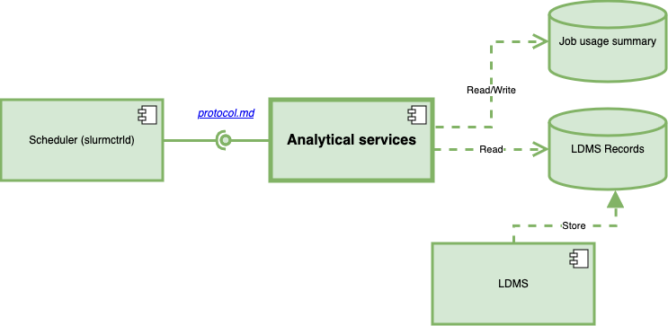

# py-sim-serv

A "simple" implementation of "analytical services" components for Slurm-LDMS project.


This repository contains source for the paper "Workload-Adaptive Scheduling for Efficient Use of Parallel File Systems in HPC Clusters" (presented at PBMS'2024). DOI: [TODO]()

## Overall design of Slurm-LDMS project



Other components of the system:
- Modified Slurm with required plugins (including instructions for installation and use):  
  https://github.com/algo74/slurm/tree/workload-adaptive-paper-2024

- LDMS:  
  https://github.com/ovis-hpc/ldms

- SOS:  
  https://github.com/ovis-hpc/sos

- NumSOS:  
  https://github.com/nick-enoent/numsos

Example of a full system:  
https://github.com/algo74/vagrant-lustre-ldms-slurm/tree/lustre_2.12.4


## Installation

The repository contains the list of Python requirements `requirements.txt` that needs to be installed for the script to work. 
The script `pysimserv3.py` works with Python 3 (and may require – not tested with Python 2.7). 
`pysimserv.py` (not maintained anymore) is an older version that requires Python 2.7.

Additionally, because Analytical Services expect on finding LDMS records in a SOS database and use SOS and NumSOS internally, all three components should be installed. Analytical Services are known to work with SOS commit `f91f14136c1150311f5a42caa0b60f1a6cbdeb92`, NumSOS commit `1467f96979f77776a50f377cb20dc928b7b5a1ea` and LDMS commit `70ea2017de535bdb42bce3174c442280183efd08`.


## Configuration

Some environmental variables are require to let `pysimserv3.py` find SOS and NumSOS modules. 
An example of setting up these environmental variables is shown in [setup3.sh](setup3.sh)

Detailed explanation of `pysimserv3.py` configuration options is provided in [pysimserv3.md](pysimserv3.md).

An example of a working system that includes these "analytical services" can be found in repository [vagrant-lustre-ldms-slurm](https://github.com/algo74/vagrant-lustre-ldms-slurm), which allows provisioning a cluster of virtual machines using Vagrant.


## Manual requests to "analytical services"

When  `pysimserv3.py` is running, the requests to it (through protocol described in [`protocol.md`](protocol.md)) can be created using script [`request3.py`](request3.py).
The typical use is 
```
python3 request3.py [-h=<host (default: localhost)>] [-p=<port (default: 9999)>] [-<parameter>=<value>] ...
```
where parameters and values are those that make sense according to the [protocol.md](protocol.md).
For most cases, if a parameter required by the protocol is missing, the script will use a reasonable default value.


## License

 Copyright (c) 2024 Alexander Goponenko. University of Central Florida.
 
 Permission is hereby granted, free of charge, to any person obtaining
 a copy of this software and associated documentation files (the
 “Software”), to deal in the Software without restriction, including
 without limitation the rights to use, copy, modify, merge, publish,
 distribute, sublicense, and/or sell copies of the Software, and
 to permit persons to whom the Software is furnished to do so,
 subject to the following conditions:
 
 The above copyright notice and this permission notice shall be
 included in all copies or substantial portions of the Software.
 
 THE SOFTWARE IS PROVIDED “AS IS”, WITHOUT WARRANTY OF ANY KIND,
 EXPRESS OR IMPLIED, INCLUDING BUT NOT LIMITED TO THE WARRANTIES
 OF MERCHANTABILITY, FITNESS FOR A PARTICULAR PURPOSE AND NONINFRINGEMENT.
 IN NO EVENT SHALL THE AUTHORS OR COPYRIGHT HOLDERS BE LIABLE
 FOR ANY CLAIM, DAMAGES OR OTHER LIABILITY, WHETHER IN AN ACTION
 OF CONTRACT, TORT OR OTHERWISE, ARISING FROM, OUT OF OR IN CONNECTION
 WITH THE SOFTWARE OR THE USE OR OTHER DEALINGS IN THE SOFTWARE.